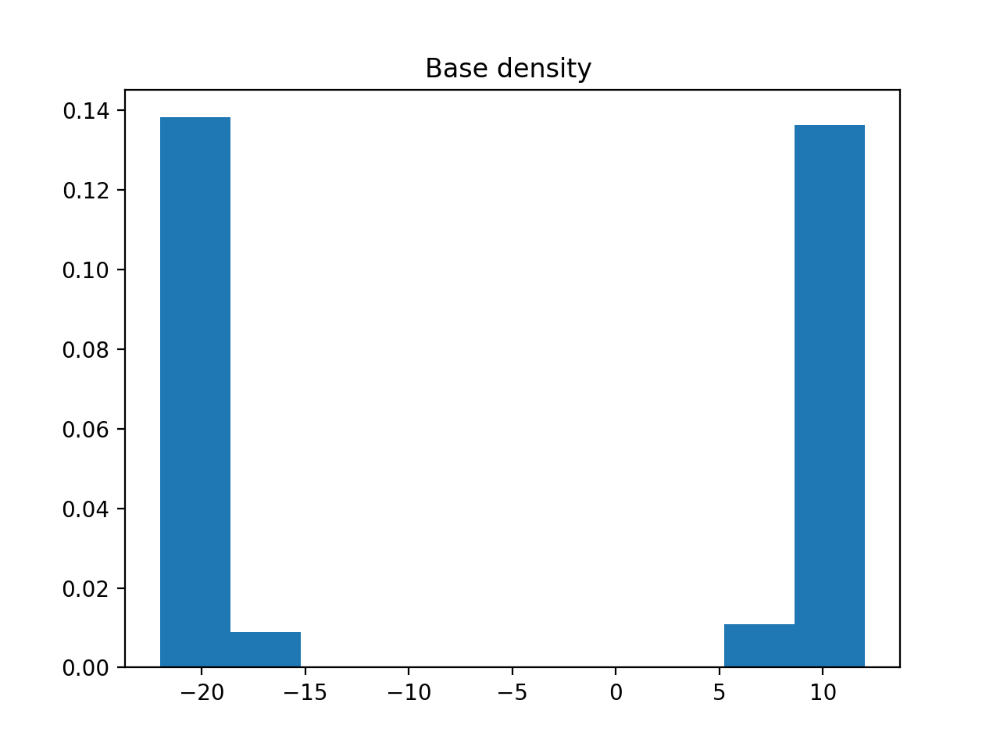
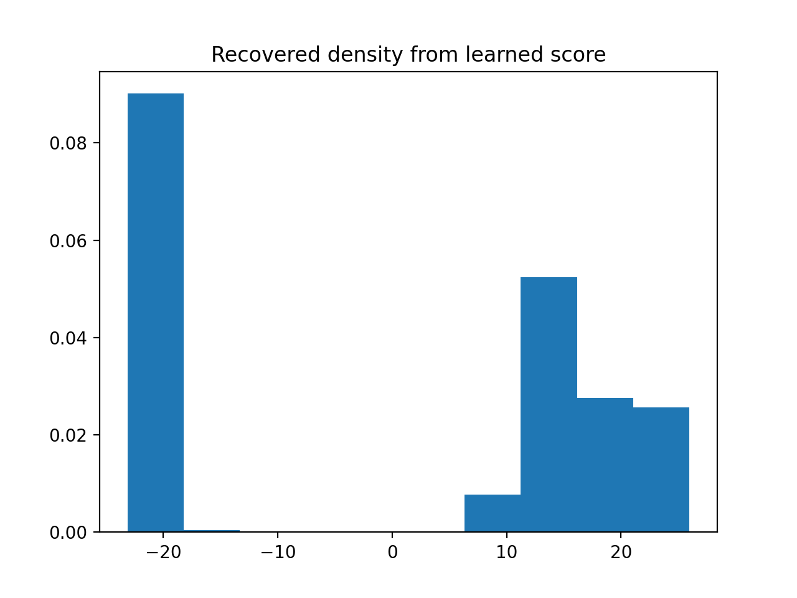

# Learning score functions from SDEs

For Math 579 Project. Currently one can run 'main.py' which learns the score function for the distribution 'base_density_1d' defined in 'density.py'. You can change this density to be any 1 dimensional density you like. 

As an example, we have learned the following base density

With the recovered density being 

Clearly, it is not perfect. I think that our choice of model could be much better and this would have the most immediate improvement on the outcome of learned densities. Also, it is essential to learn a higher dimensional density to show the method works. 

Furthermore, we could use a different SDE. 
